# 🍰 Slastičarna – Web aplikacija

_Web aplikacija za naručivanje proizvoda slastičarne i upravljanje narudžbama_

---

## 📌 Uvod

Ovaj projekat predstavlja razvoj web aplikacije pod nazivom **Slastičarna**, čiji je cilj omogućiti kupcima pregled proizvoda, naručivanje putem korpe i praćenje narudžbi, a administratorima upravljanje proizvodima, narudžbama, lokacijom i statistikom. Aplikacija je izrađena u **Laravel** okruženju s **Breeze** autentifikacijom i **Blade** predlošcima.

---

## 🧩 Opis aplikacije

Aplikacija **Slastičarna** je web platforma namijenjena kupcima i administratorima slastičarne. Sistem je osmišljen tako da omogući:

**Kupcima:**

- 🔍 pregled kataloga proizvoda (s pretragom i filterom po kategoriji)
- 🛒 dodavanje proizvoda u korpu i ažuriranje količine
- 📄 dovršetak narudžbe putem checkouta (adresa, telefon, napomena)
- 📋 pregled vlastitih narudžbi i statusa
- 📍 pregled lokacije slastičarne na karti (Leaflet)
- 🌡️ prikaz trenutne temperature na lokaciji slastičarne (Open-Meteo API)

**Administratorima:**

- 📦 upravljanje proizvodima (dodavanje, uređivanje, brisanje, kategorije, cijene u KM)
- 📋 pregled i ažuriranje statusa narudžbi
- 📊 statistika (ukupni prihod, narudžbe po statusu, top proizvodi)
- 📍 uređivanje lokacije slastičarne (naziv, adresa, lat/lng, telefon, radijus dostave)

Cijene su prikazane u **KM** (konvertibilna marka). Lokacija i vremenska prognoza na stranici Proizvodi uvijek se učitavaju iz baze (tablica `restaurant_locations`), tako da promjena lokacije u admin panelu odmah utječe na prikaz.

---

## 🖥️ Prikaz aplikacije

U nastavku je prikazan vizuelni izgled aplikacije kroz osnovne stranice i funkcionalnosti.

---

### 🔐 Prijava na sistem

Stranica za prijavu omogućava registriranim korisnicima pristup aplikaciji unosom e-mail adrese i lozinke.

<p align="center">
  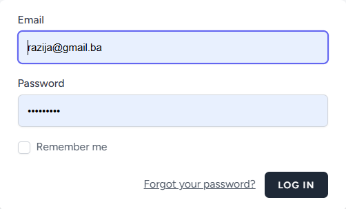
</p>

---

### 📝 Registracija korisnika

Stranica za registraciju omogućava kreiranje novog korisničkog računa.

<p align="center">
  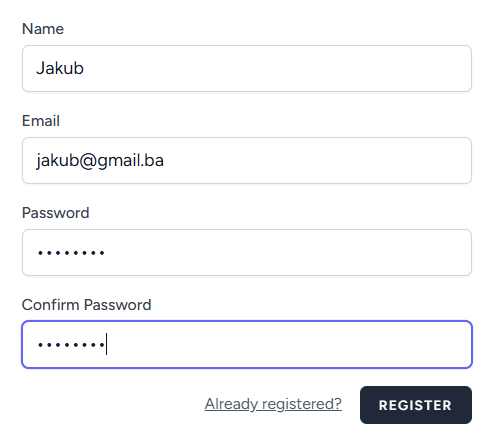
</p>

---

### 🏠 Dashboard – kupac

Početna stranica nakon prijave prikazuje hero sekciju s pozdravom korisnika (slika kafića, puna visina prozora ispod navigacije).

<p align="center">
  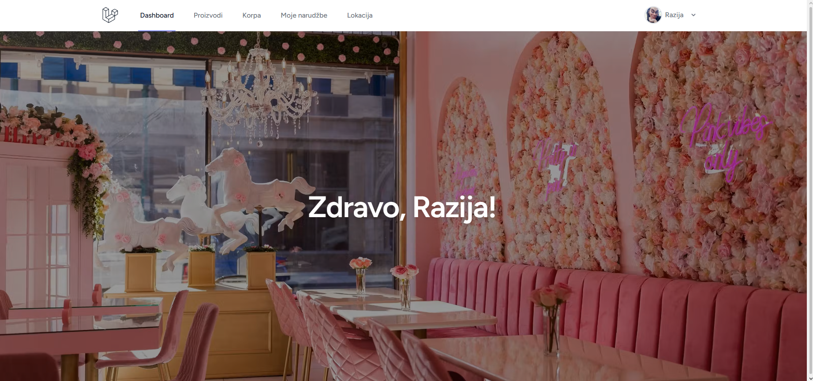
</p>

---

### 🏠 Dashboard – admin

Administratorski dashboard s istom hero sekcijom i pozdravom.

<p align="center">
  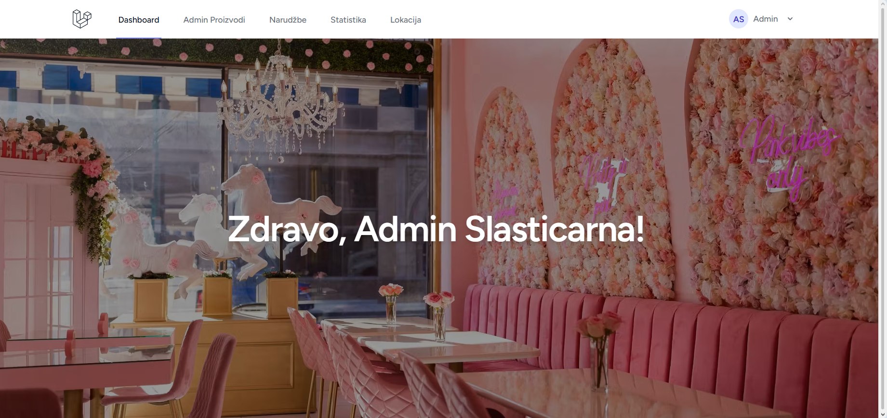
</p>

---

### 📦 Proizvodi – kupac

Stranica s katalogom proizvoda: filter po kategoriji, pretraga, vremenska prognoza na lokaciji slastičarne, cijene u KM i dugme za dodavanje u korpu.

<p align="center">
  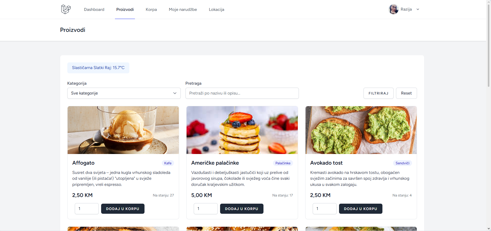
</p>

---

### 🛒 Korpa

Pregled stavki u korpi, ažuriranje količine, uklanjanje stavki i ukupan iznos u KM.

<p align="center">
  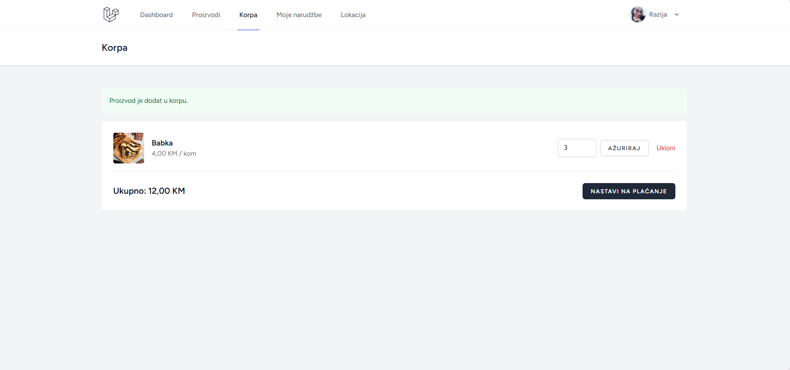
</p>

---

### 📄 Rezime narudžbe (checkout)

Stranica za potvrdu narudžbe: rezime stavki, ukupno u KM, unos telefona, adrese dostave i opcionalne napomene.

<p align="center">
  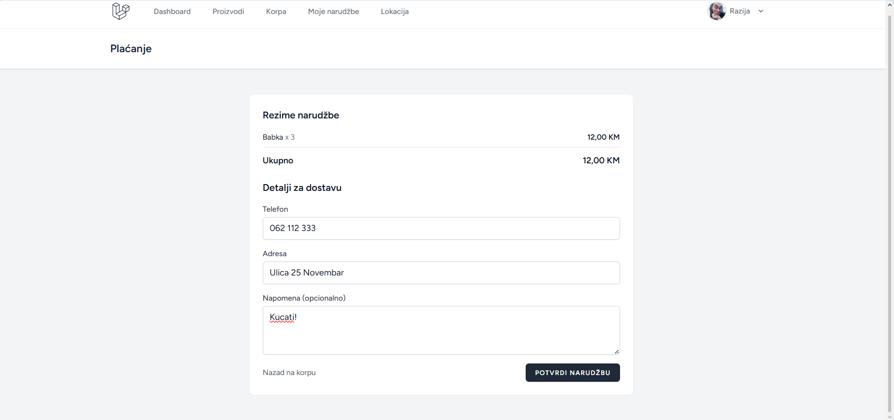
</p>

---

### 📋 Moje narudžbe – kupac

Lista narudžbi kupca s datumom, statusom i ukupnim iznosom u KM.

<p align="center">
  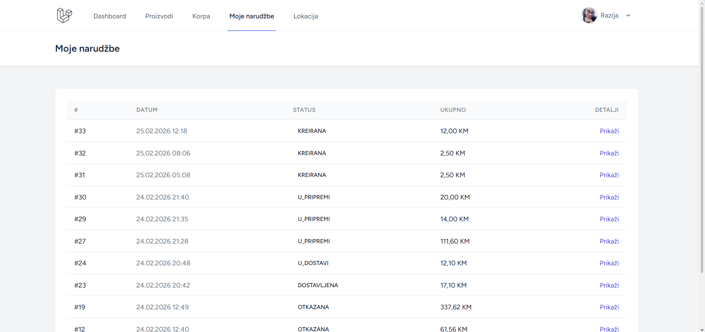
</p>

---

### ✅ Potvrđena narudžba – kupac

Detalji pojedinačne narudžbe: status, datum, adresa, stavke i historija promjena statusa.

<p align="center">
  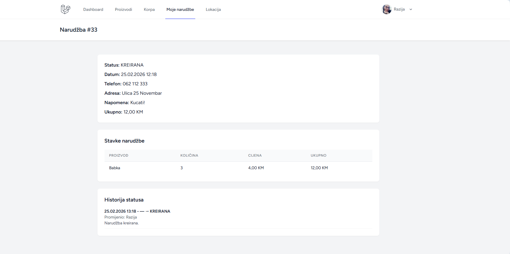
</p>

---

### 📍 Lokacija slastičarne – kupac

Stranica s kartom (Leaflet) koja prikazuje lokaciju slastičarne; podaci se učitavaju iz baze putem API-ja `/api/location`.

<p align="center">
  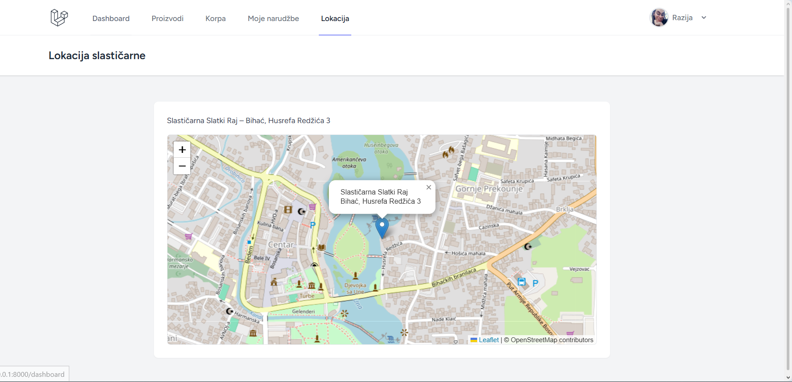
</p>

---

### 👤 Profil – kupac

Pregled i uređivanje profila kupca (ime, e-mail, profilna slika).

<p align="center">
  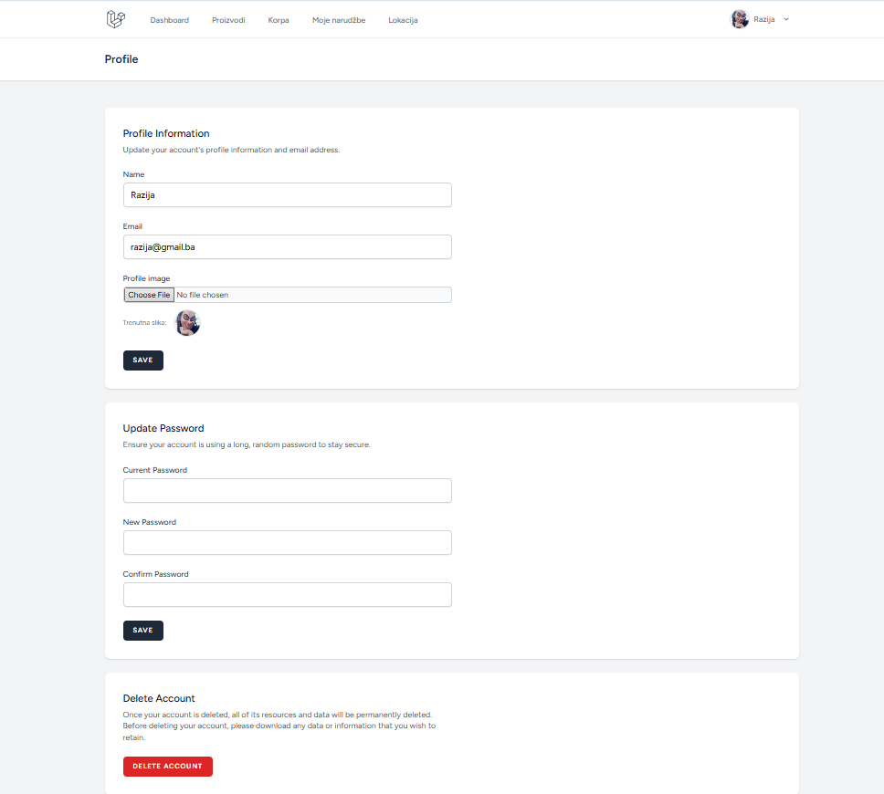
</p>

---

### 📦 Admin – proizvodi

Administratorska lista proizvoda s slikom, nazivom, kategorijom, cijenom (KM), stanjem i akcijama (uredi / obriši).

<p align="center">
  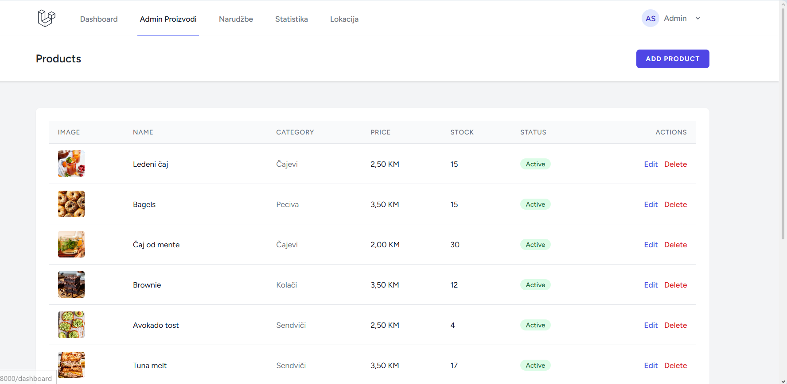
</p>

---

### ➕ Admin – dodavanje proizvoda

Forma za kreiranje novog proizvoda (kategorija, naziv, opis, cijena u KM, stanje, slika, aktivnost).

<p align="center">
  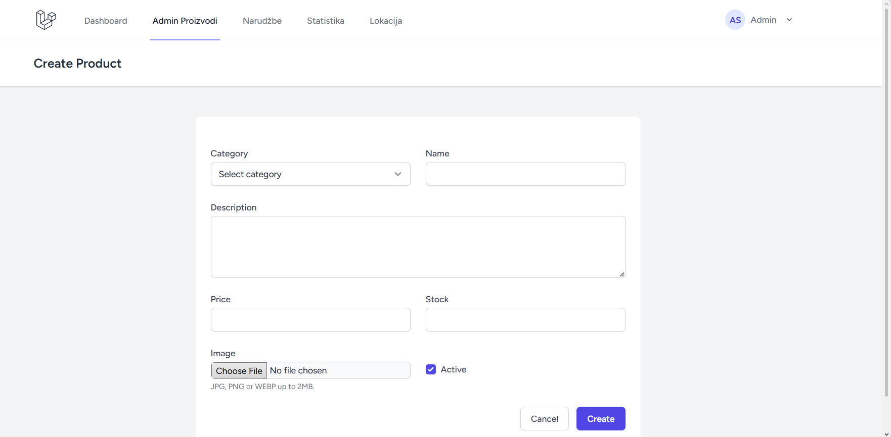
</p>

---

### 📋 Admin – narudžbe

Pregled svih narudžbi s korisnikom, datumom, statusom i ukupnim iznosom u KM.

<p align="center">
  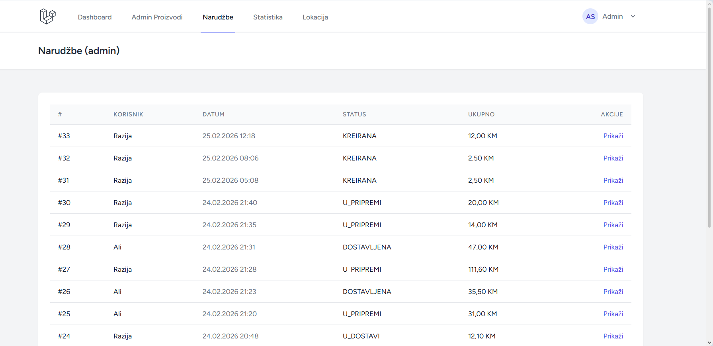
</p>

---

### ✏️ Admin – ažurirana narudžba

Detalji narudžbe i forma za promjenu statusa narudžbe (npr. prihvaćena, u pripremi, u dostavi, dostavljena).

<p align="center">
  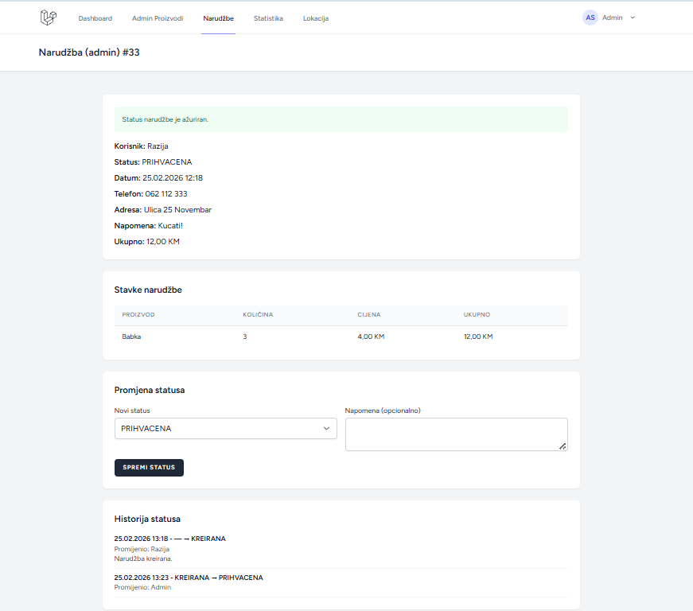
</p>

---

### 📊 Admin – statistika

Ukupni prihod u KM, graf narudžbi po statusu i top 5 proizvoda po prodanoj količini.

<p align="center">
  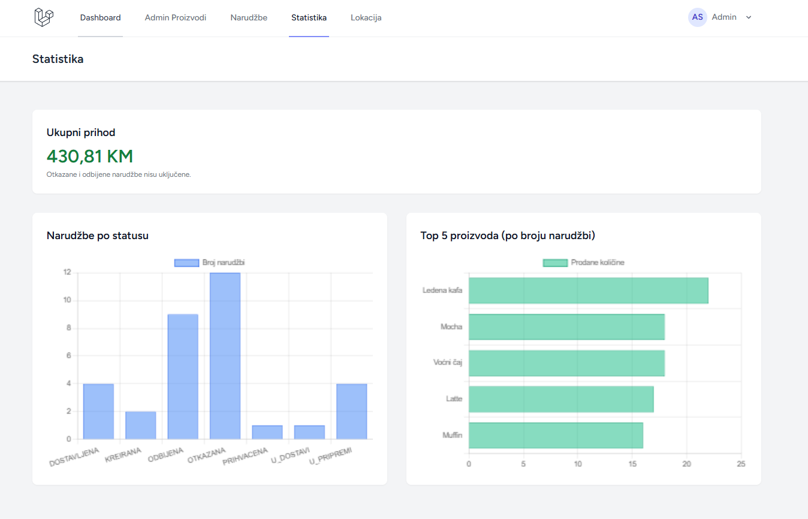
</p>

---

### 📍 Admin – lokacija

Forma za uređivanje lokacije slastičarne: naziv, adresa, lat/lng, telefon, radijus dostave (km). Ove podatke koriste stranica Lokacija i API-ji `/api/location` te `/api/weather`.

<p align="center">
  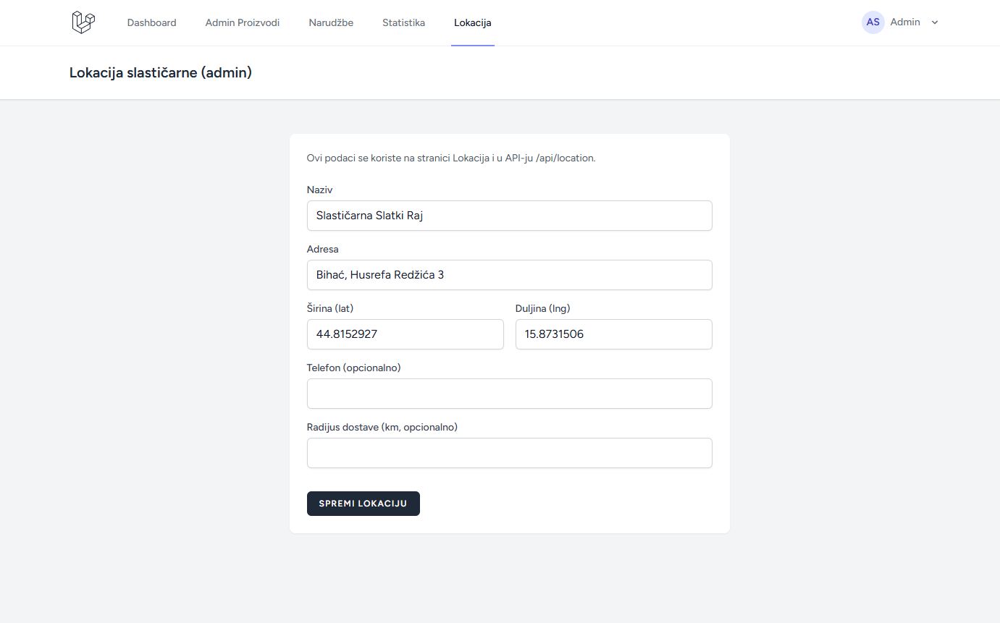
</p>

---

### 👤 Admin – profil

Profil administratora (uređivanje podataka i profilne slike).

<p align="center">
  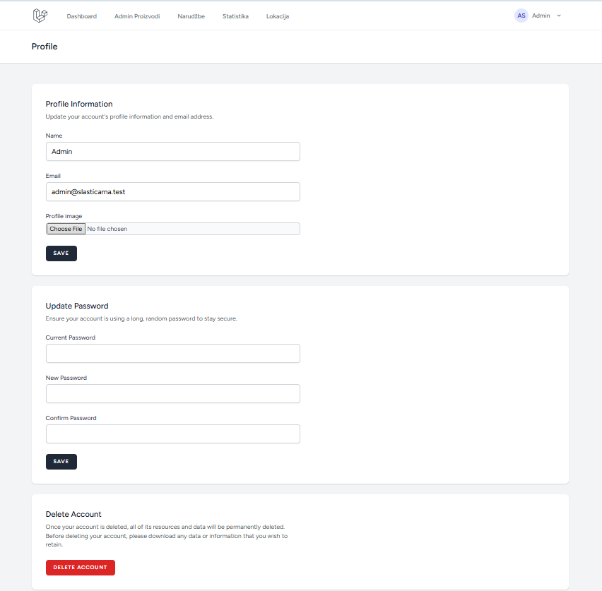
</p>

---

## 🛠️ Tehnologije i zahtjevi

- **Backend:** Laravel 12, PHP 8.2+
- **Autentifikacija:** Laravel Breeze (Blade)
- **Frontend:** Blade predlošci, Tailwind CSS, Vite, Alpine.js
- **Baza podataka:** MySQL / PostgreSQL / SQLite (preko Laravel Eloquent)
- **API za vrijeme:** Open-Meteo (temperatura na temelju lat/lng lokacije slastičarne)
- **Karta:** Leaflet (stranica Lokacija)

---

## ⚙️ Pokretanje projekta

1. Kloniraj repozitorij i uđi u folder projekta.
2. Instaliraj PHP ovisnosti:
   ```bash
   composer install
   ```
3. Kopiraj `.env.example` u `.env` i prilagodi bazu i ostale postavke:
   ```bash
   cp .env.example .env
   php artisan key:generate
   ```
4. Pokreni migracije (i po želji seedere):
   ```bash
   php artisan migrate
   php artisan db:seed
   ```
5. Poveži storage za upload slika (proizvodi, profil):
   ```bash
   php artisan storage:link
   ```
6. Instaliraj NPM ovisnosti i pokreni Vite:
   ```bash
   npm install
   npm run dev
   ```
7. U drugom terminalu pokreni Laravel:
   ```bash
   php artisan serve
   ```

Aplikacija je dostupna na `http://localhost:8000`. Za admin pristup korisniku u bazi treba dodijeliti ulogu `ADMIN` (npr. u polju `role` u tabeli `users`).

---

## 📁 Važniji dijelovi projekta

- **Rute:** `routes/web.php` (web rute), `routes/auth.php` (Breeze prijava/registracija)
- **Kontroleri:** `app/Http/Controllers/` (ProductController, CartController, CheckoutController, OrderController, ProfileController; admin: Product, Order, Stats, Location)
- **Modeli:** User, Product, Category, Order, OrderItem, CartItem, RestaurantLocation
- **API:** `GET /api/location` (lokacija slastičarne), `GET /api/weather` (vrijeme na lokaciji)
- **Pogledi:** `resources/views/` (dashboard, products, cart, checkout, orders, location, admin, profile)
- **Pomoćnik za valutu:** `app/Helpers/helpers.php` – funkcija `format_km()` za ispis cijena u KM (npr. 3.517,41 KM)

---

## 🎯 Zaključak

Aplikacija **Slastičarna** omogućava kupcima jednostavno pregledavanje proizvoda, naručivanje putem korpe i praćenje narudžbi, a administratorima potpunu kontrolu nad proizvodima, narudžbama, lokacijom i statistikom. Integracija s Open-Meteo i Leafletom osigurava da su lokacija i vrijeme uvijek usklađeni s podacima iz baze koje admin može mijenjati na jednom mjestu.
